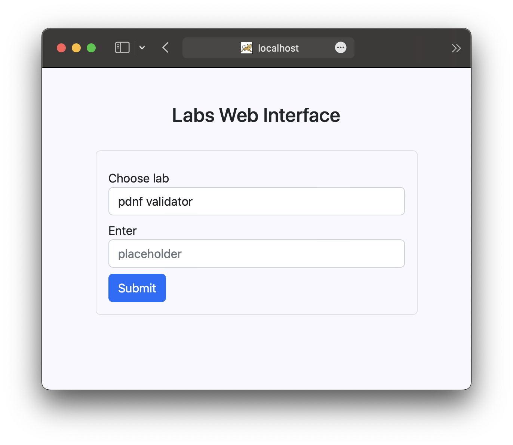

# Labs Web Interface

The point of this repository is to make a microservice application for labs submitting, where each lab is an independent service (rest server).

## Run

Run microservices application gateway:
```shell
git clone https://github.com/glebchanskiy/labs-interface
cd labs-interface

./mvnw package
java -jar target/labs_interface-0.0.1-SNAPSHOT.war
```


## Labs-services
After running labs interface, you can launch the necessary services. Now available:
- [lois-service-lab1](https://github.com/glebchanskiy/lois-service-lab1)
- [aois-service-lab3](https://github.com/glebchanskiy/aois-service-lab3)
